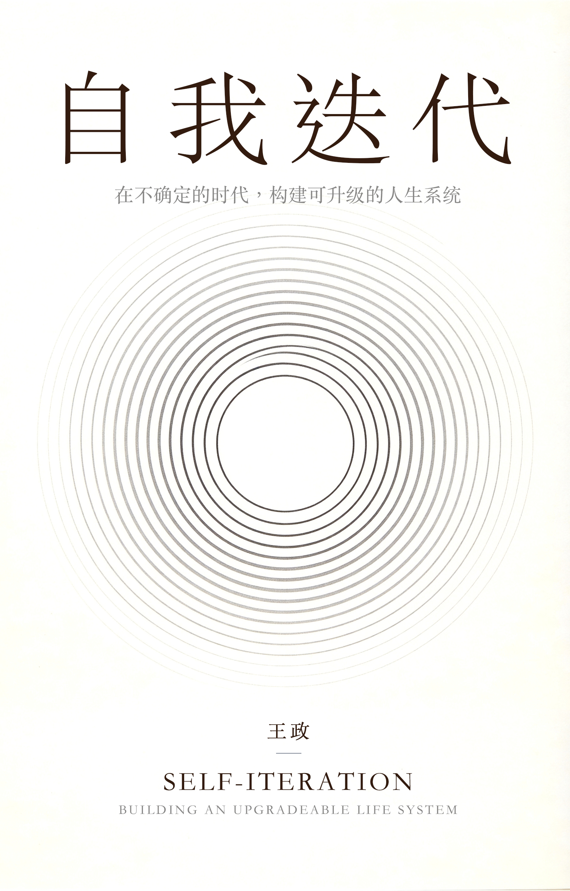

# 自我迭代 · Self-Iteration Skill

> 把人生当作一个可以不断迭代的产品来经营。

《自我迭代》作者王叔（Clarck Wang）的 Agent Skill。当你需要关于**个人成长、能力复利、职业转型、AI 时代生存**的思考时，这个 Skill 会调用《自我迭代》的核心框架来帮助你梳理问题、找到路径。

<p align="center">
  
</p>

## 关于这本书

《自我迭代》是一本关于**人生操作系统**的书。它不教你碎片化的技巧，而是从底层逻辑出发，把人生当作一个可以不断迭代的产品来经营：

- **底层逻辑**：看清重复与成长的区别、努力如何贬值、人才密度的杠杆
- **人生系统**：认知边界、身体、情绪、专注力——构建稳定的人生底座
- **能力复利**：如何构建真正能复利增长的核心能力，并不断放大
- **外部杠杆**：环境跃迁、城市机会、第二曲线，借势实现跃迁
- **未来视角**：终身学习系统、人生路线图，在 AI 时代活得从容

这个 Skill 正是把书中的框架封装成可对话的智能助手——你问，它用《自我迭代》的方式帮你思考。

## 安装

### Claude Code / 支持 `npx skills` 的 Agent

```bash
npx skills add clarck7gmailcom/self-iteration-skill
```

安装后，在对话中提出你的人生 / 成长 / 职业问题，Skill 会自动按书中的框架给你拆解与建议。

### 手动安装（任意 Agent）

把本仓库的 `SKILL.md` 及 `chapters/`、`glossary.md`、`patterns.md`、`cheatsheet.md` 放到你的 Agent skills 目录（如 `.agents/skills/self-iteration/`）即可。

## Skill 覆盖的主题

- **底层逻辑**：重复 vs 成长、努力的贬值、人才密度（Ch 1-3）
- **人生系统**：人生操作系统、认知边界、身体、情绪（Ch 6-9）
- **能力复利**：复利能力、核心能力、连接能力、放大（Ch 11-14）
- **外部杠杆**：环境跃迁、城市机会、第二曲线、迭代循环（Ch 16-19）
- **未来视角**：终身学习系统、人生路线图（Ch 20-21）

## 示例问题

- "我现在的工作感觉在重复，怎么判断要不要跳出来？"
- "如何构建真正能复利增长的能力？"
- "AI 时代，普通人靠什么活下来、赚到钱？"
- "我想规划未来三年的职业转型，该怎么拆？"

## 关于作者

王叔（Clarck Wang），医生 / PhD / 硅谷创业者，撰写《自我迭代》。更多文章见 [olawang.com](https://www.olawang.com)。

## 许可

本 Skill 内容基于《自我迭代》，仅供个人学习使用。如需商用或转载，请联系作者。
